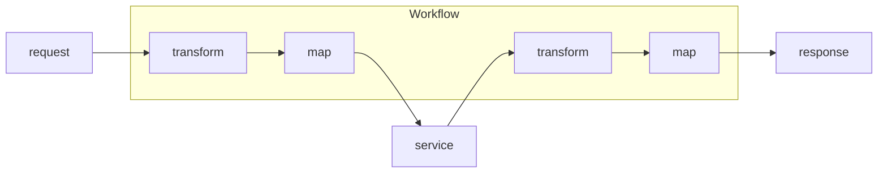
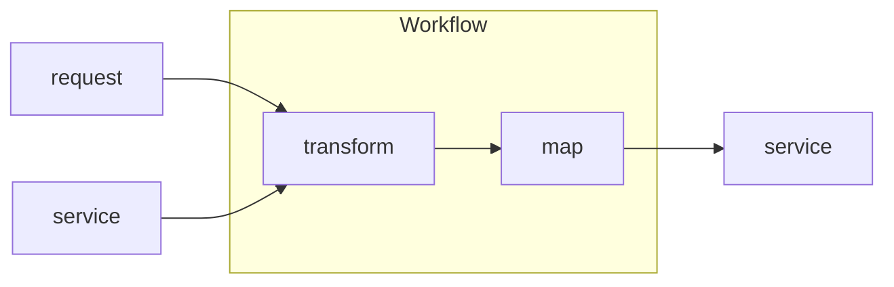
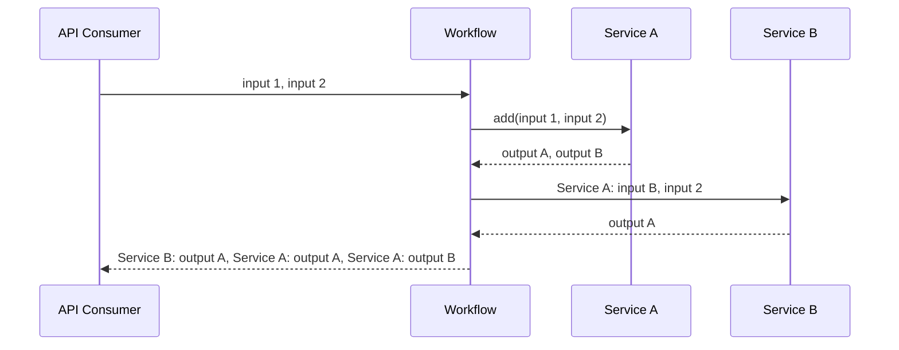
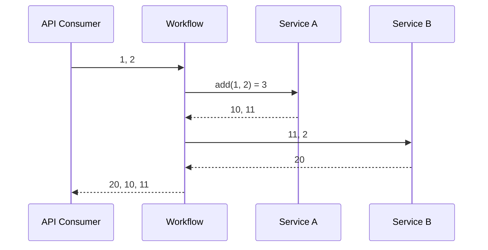

# Service Orchestrator

Service orchestrator without the boilerplate.

## Workflow Architecture

Each endpoint of the orchestrator is defined with a workflow. A workflow has
discrete configuratable steps with narrowly-defined responsibility.



The values from a service response can be used as part of the request to another
service.



## Overall Architecture

1. Provide Open API specifications for orchestrator endpoints and dependent
   services
2. Create workflow specifications using domain-specific language

Given a Workflow Request/Response:

```yaml
Request
    input 1
    input 2
Response
    output 1
    output 2
    output 3
```

And a service called `Service A` with Request/Response:

```yaml
Request
    input A
Response
    output A
    output B
```

And a service called `Service B` with Request/Response:

```yaml
Request
    input A
    input B
Response
    output A
```

Potential Example of Workflow Specification:

```yaml
Workflow A:
    transform:
        inputSum: add(input 1, input 2)
    Service A:
        request:
            map:
                input A: inputSum
    Service B:
        request:
            map:
                input A: "Service A: input B"
                input B: input 2
    response:
        output1: "Service B: output A"
        output2: "Service A: output A"
        output3: "Service A: output B"
```

The sequence diagram of Workflow A:



The sequence diagram with example concrete values:


