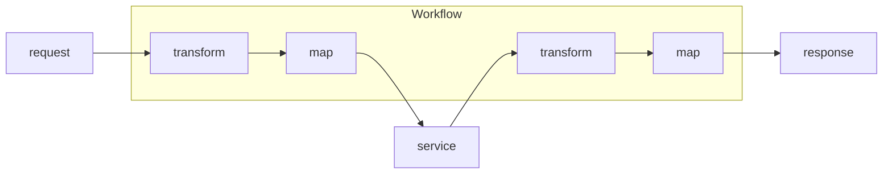
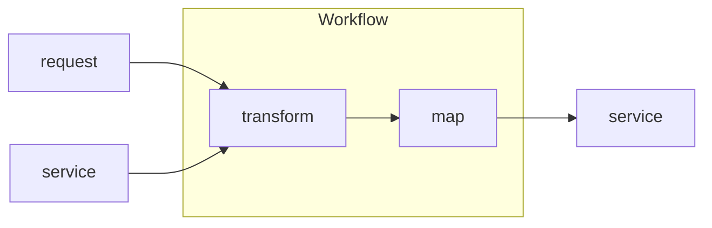

# Service Orchestrator

Service orchestrator without the boilerplate.

## Workflow Architecture

Each endpoint of the orchestrator is defined with a workflow. A workflow has
discrete configuratable steps with narrowly-defined responsibility.

The values from a service response can be used as part of the request to another
service.

